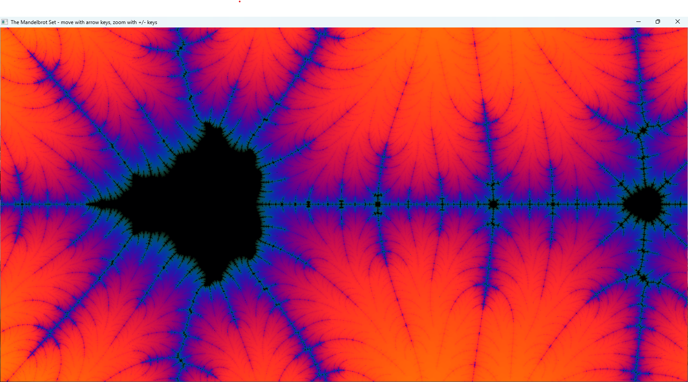

# mandelbrot_viewer

A simple Win32 app for viewing and exploring the Mandelbrot set.



# Usage

```
cmake .
make
.\mandelbrot.exe
```
or
```
gcc .\mandelbrot.c -o .\mandelbrot.exe -luser32 -lgdi32
.\mandelbrot.exe
```

The rendering is slowest when there is a lot of black,
so if you want to go places, make the window tiny
and stay out of the black.